# Applied Time Series Analysis System: Global Climate Change Forecasting and Trend Analysis

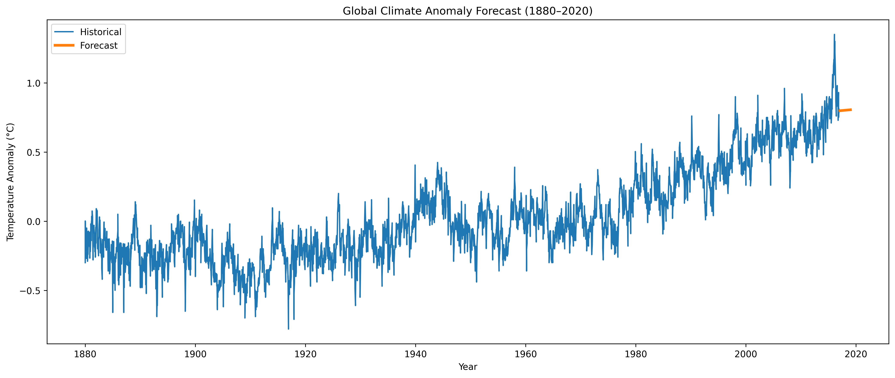

## Overview

The Applied Time Series Analysis System is a comprehensive statistical forecasting project that investigates long-term global climate temperature anomalies using classical and modern time series methodologies.

Using over 136 years of monthly climate anomaly observations, the project applies exploratory time series analysis, stationarity testing, decomposition techniques, and predictive forecasting models to understand historical climate behavior and forecast future temperature anomalies.

The analysis demonstrates how statistical modeling can uncover long-term environmental trends, quantify climate variability, and support evidence-based forecasting of future climate conditions.

---

## Research Question

**Can statistical time series methods effectively model, analyze, and forecast long-term global temperature anomalies?**

---

## Dataset

This project uses a global climate temperature anomaly dataset containing monthly temperature anomaly measurements collected from multiple climate monitoring sources.

### Dataset Characteristics

| Feature        |                      Value |
| -------------- | -------------------------: |
| Observations   |                      1,644 |
| Time Frequency |                    Monthly |
| Study Period   |                  1880–2016 |
| Variable       | Global Temperature Anomaly |
| Missing Values |                          0 |

### Key Variables

| Variable | Description                     |
| -------- | ------------------------------- |
| Date     | Observation date                |
| Mean     | Global temperature anomaly (°C) |
| Source   | Climate data source             |

### Data Sources

The dataset contains observations from:

* GCAG
* GISTEMP

Each source contributed 1,644 climate records used in the analysis.

---

## Project Objectives

* Investigate long-term climate temperature behavior
* Identify warming trends and structural patterns
* Assess stationarity properties of climate anomalies
* Decompose the series into trend, seasonal, and residual components
* Compare forecasting approaches
* Generate future climate anomaly forecasts
* Demonstrate practical applications of Applied Time Series Analysis

---

## Methodology

### Notebook 01: Data Collection and Preprocessing

The dataset was loaded, inspected, cleaned, and transformed into a time series format suitable for statistical analysis.

Key tasks included:

* Data quality assessment
* Missing value evaluation
* Date conversion
* Time series indexing
* Source validation

---

### Notebook 02: Exploratory Time Series Analysis

Exploratory analysis was conducted to understand the distribution and temporal behavior of climate anomalies.

#### Dataset Summary

| Statistic          |   Value |
| ------------------ | ------: |
| Mean               |  0.0366 |
| Standard Deviation |  0.3337 |
| Minimum            | -0.6848 |
| Maximum            |  1.2711 |

### Monthly Climate Anomalies

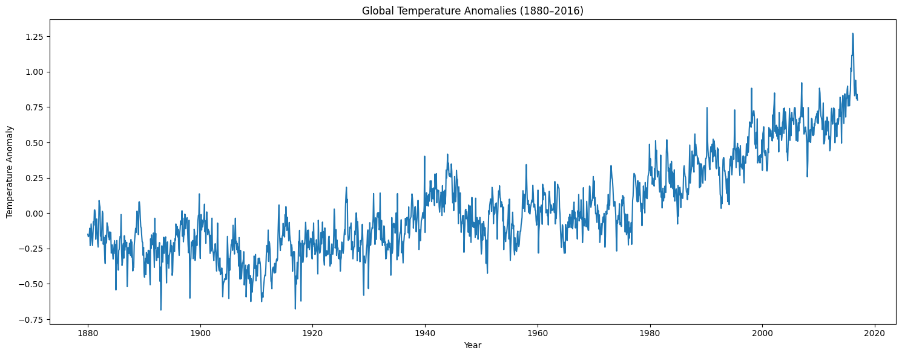

The time series visualization revealed a persistent upward trend in global temperature anomalies over the study period.

### Annual Temperature Trends

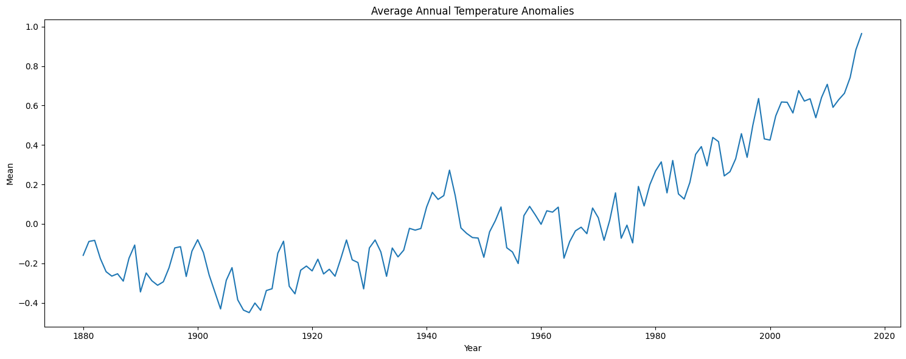

Annual aggregation highlighted long-term warming behavior and increasing positive temperature anomalies in recent decades.

### Rolling Trend Analysis

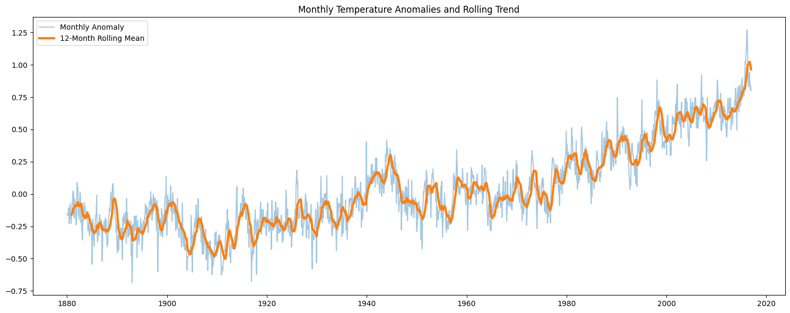

Rolling averages further confirmed the presence of a sustained warming trend across the historical record.

#### Key Finding

The exploratory analysis provided strong preliminary evidence of long-term climate warming, motivating further statistical investigation.

---

## Stationarity Analysis

### Visual Stationarity Assessment

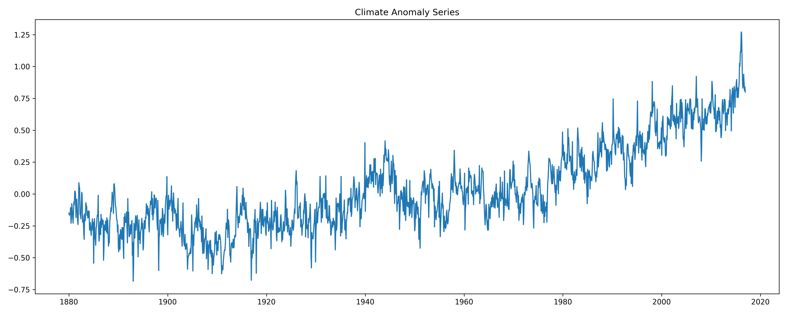

Visual inspection suggested that the mean level of the series changes over time, indicating potential non-stationarity.

---

### Augmented Dickey-Fuller (ADF) Test

#### Original Series

| Metric        |  Value |
| ------------- | -----: |
| ADF Statistic | -0.425 |
| P-Value       | 0.9058 |

Interpretation:

* Fail to reject the null hypothesis
* Series is non-stationary

---

### First Difference Series

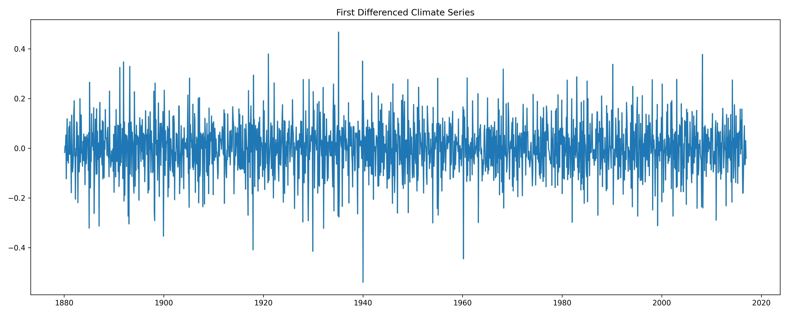

#### Differenced Series Results

| Metric        |        Value |
| ------------- | -----------: |
| ADF Statistic |      -11.935 |
| P-Value       | 4.69 × 10⁻²² |

Interpretation:

* Reject the null hypothesis
* Series becomes stationary after differencing

### Stationarity Comparison

| Series           | ADF Statistic |  P-Value |
| ---------------- | ------------: | -------: |
| Original         |        -0.425 |   0.9058 |
| First Difference |       -11.935 | 4.69e-22 |

#### Key Finding

The climate anomaly series is integrated of order one (I(1)), requiring first differencing before applying classical forecasting models.

---

## Time Series Decomposition

Time series decomposition was used to separate the climate anomaly series into:

* Trend
* Seasonal
* Residual components

### Decomposition Results

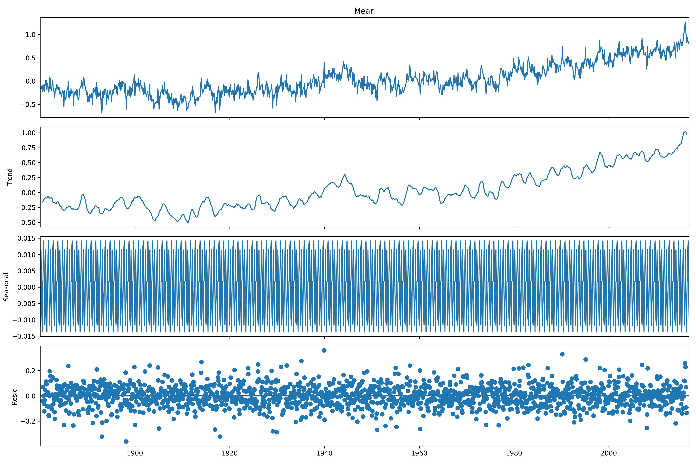

---

### Trend Component

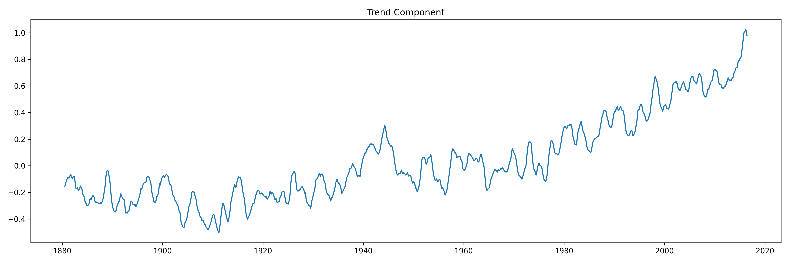

| Statistic |  Value |
| --------- | -----: |
| Mean      |  0.034 |
| Std Dev   |  0.316 |
| Minimum   | -0.502 |
| Maximum   |  1.022 |

#### Interpretation

The trend component increased from approximately -0.50°C to over +1.0°C, providing strong statistical evidence of long-term global warming.

---

### Seasonal Component

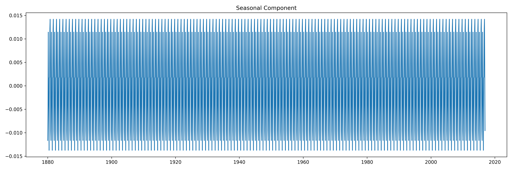

| Statistic |   Value |
| --------- | ------: |
| Mean      |      ~0 |
| Std Dev   |   0.009 |
| Minimum   | -0.0137 |
| Maximum   |  0.0142 |

#### Interpretation

Seasonal effects were present but relatively small compared to the dominant long-term warming trend.

---

### Residual Component

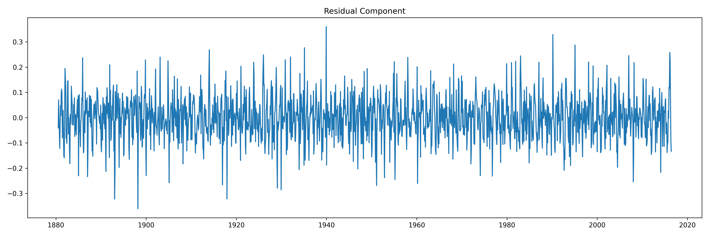

| Statistic |  Value |
| --------- | -----: |
| Mean      | 0.0001 |
| Std Dev   |  0.086 |
| Minimum   | -0.360 |
| Maximum   |  0.360 |

#### Interpretation

Residuals were centered near zero and exhibited relatively stable variance, suggesting that the decomposition successfully captured the major structure of the climate anomaly process.

---

## Forecasting Models

Four forecasting approaches were evaluated using out-of-sample testing.

### Forecast Model Comparison

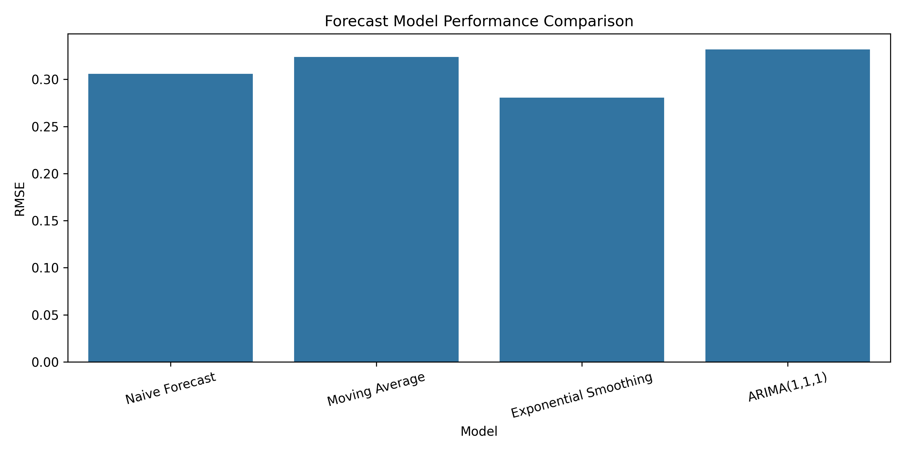

| Model                 |       RMSE |
| --------------------- | ---------: |
| Exponential Smoothing | **0.2807** |
| Naive Forecast        |     0.3058 |
| Moving Average        |     0.3239 |
| ARIMA (1,1,1)         |     0.3318 |

---

### Best Forecasting Model

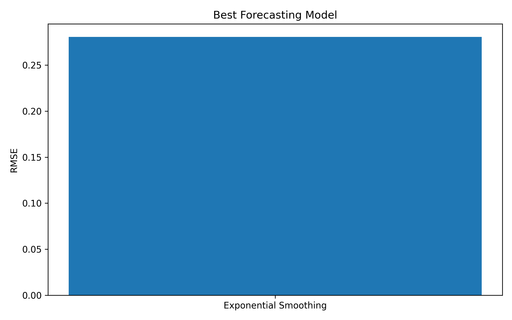

🏆 **Exponential Smoothing**

The Exponential Smoothing model achieved the lowest forecasting error and was selected as the final forecasting model.

---

### Forecast vs Actual

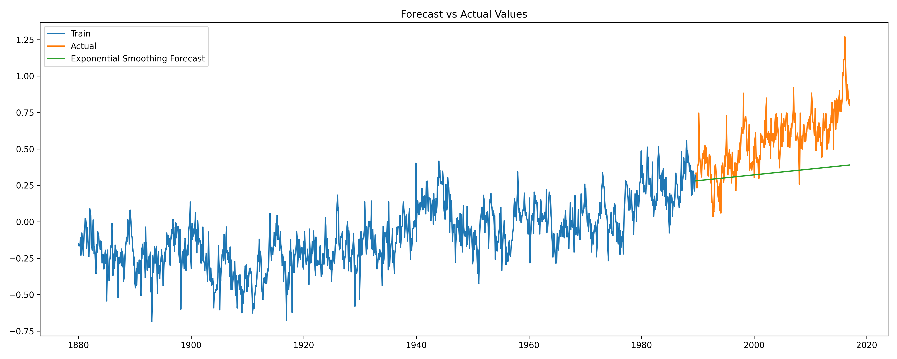

The selected model successfully captured the underlying trend in climate anomalies and produced accurate out-of-sample forecasts.

---

## Future Climate Forecast

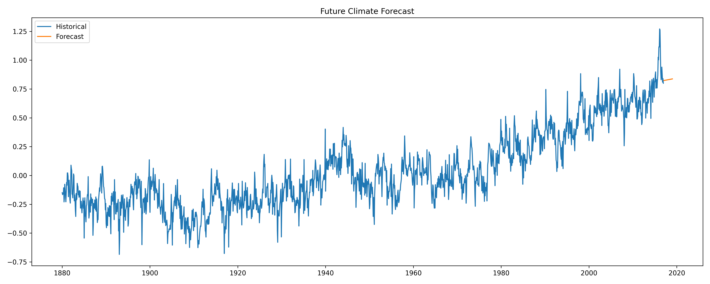

A 24-month forecast was generated using the best-performing model.

### Forecast Summary

| Period   | Forecast |
| -------- | -------: |
| Month 1  |   0.8239 |
| Month 24 |   0.8376 |

### Interpretation

The forecast projects continued positive temperature anomalies throughout the forecast horizon, suggesting that the long-term warming trend remains persistent.

---

## Research Findings Summary

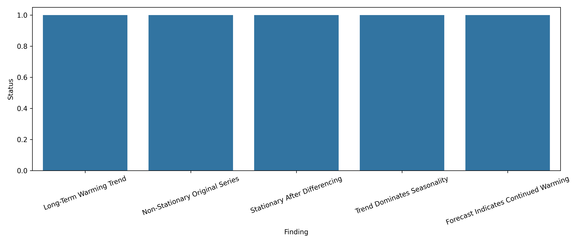

### Major Findings

✅ Significant long-term warming trend identified

✅ Original series is non-stationary

✅ First differencing achieves stationarity

✅ Trend component dominates seasonal behavior

✅ Residual variation remains relatively stable

✅ Exponential Smoothing outperforms competing forecasting models

✅ Future forecasts suggest continued positive temperature anomalies

---

## Final Dashboard

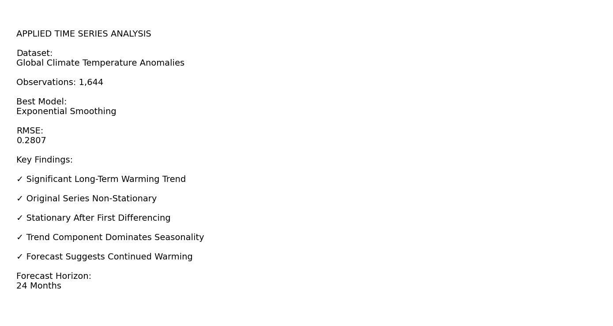

The dashboard consolidates the primary statistical findings and forecasting results into a single analytical summary.

---

## Technologies Used

* Python
* Pandas
* NumPy
* Matplotlib
* Seaborn
* Statsmodels
* Scikit-Learn
* Jupyter Notebook

---

## Repository Structure

```text
applied-time-series-analysis-system/
│
├── data/
│
├── image/
│   ├── portfolio_cover_image.png
│   ├── monthly_temperature_anomalies.png
│   ├── annual_temperature_trend.png
│   ├── rolling_average_trend.png
│   ├── stationarity_visual_check.png
│   ├── first_difference_series.png
│   ├── time_series_decomposition.png
│   ├── trend_component.png
│   ├── seasonal_component.png
│   ├── residual_component.png
│   ├── forecast_vs_actual.png
│   ├── future_forecast.png
│   ├── forecast_model_comparison.png
│   ├── best_forecasting_model.png
│   ├── research_findings_summary.png
│   └── project_dashboard.png
│
├── notebooks/
│   ├── 01_data_collection_and_preprocessing.ipynb
│   ├── 02_exploratory_time_series_analysis.ipynb
│   ├── 03_stationarity_testing.ipynb
│   ├── 04_time_series_decomposition.ipynb
│   ├── 05_forecasting_models.ipynb
│   └── 06_model_evaluation_and_dashboard.ipynb
│
├── README.md
├── requirements.txt
└── LICENSE
```

---

## Statistical Techniques Demonstrated

* Time Series Visualization
* Rolling Statistics
* Trend Analysis
* Stationarity Testing
* Augmented Dickey-Fuller Testing
* Time Series Differencing
* Seasonal Decomposition
* Forecast Evaluation
* Exponential Smoothing
* ARIMA Modeling
* Forecast Accuracy Assessment
* Future Climate Forecasting

---

## Portfolio Relevance

This project demonstrates practical applications of:

* Applied Time Series Analysis
* Computational Statistics
* Statistical Learning
* Climate Data Analytics
* Forecasting and Predictive Modeling
* Environmental Data Science
* Quantitative Research

The project showcases the complete workflow required for real-world time series forecasting, from data preprocessing and exploratory analysis through model development, evaluation, and future prediction.

---

## Future Enhancements

* Seasonal ARIMA (SARIMA) modeling
* Prophet forecasting models
* Bayesian time series methods
* Deep learning forecasting architectures
* Real-time climate monitoring systems
* Interactive dashboard deployment
* Multivariate climate forecasting

---

## Author

**Clement Kofi Okyere Biew**

Statistics | Data Science | Applied Time Series Analysis | Computational Statistics | Machine Learning | Quantitative Research
